# Hi there 👋

  

  </img>
  </img>

- 🛖[main](https://nanxi.tech)
- 💰[赞助](https://afdian.com/a/babynanxi)
- 👨🏻‍🎓From China
- 🐠Touch fish~
- 🐤Just a Rookie
- 🥰Love to learn
- 😭Single

## 📖 **Learning**

## 🌍 **Environment**

## 🎮 Playing **Games**

- Genshin Impact
- League of Legends
- ...

## 🎮 My **Genshin** Info

