# Hi there 👋

  

  </img>
  </img>

## 🌟 I'm **南兮**

- 👨🏻‍🎓A Chinese Student
- 🐠Touch fish~
- 🐤Just a Rookie
- 🤖Developing a [Genshin Impact Bot](https://github.com/CMHopeSunshine/LittlePaimon)

## 📖 **Learning**

## 🌍 **Environment**

## 🎮 Playing **Games**

- Genshin Impact
- League of Legends
- ...

## 🎮 My **Genshin** Info

